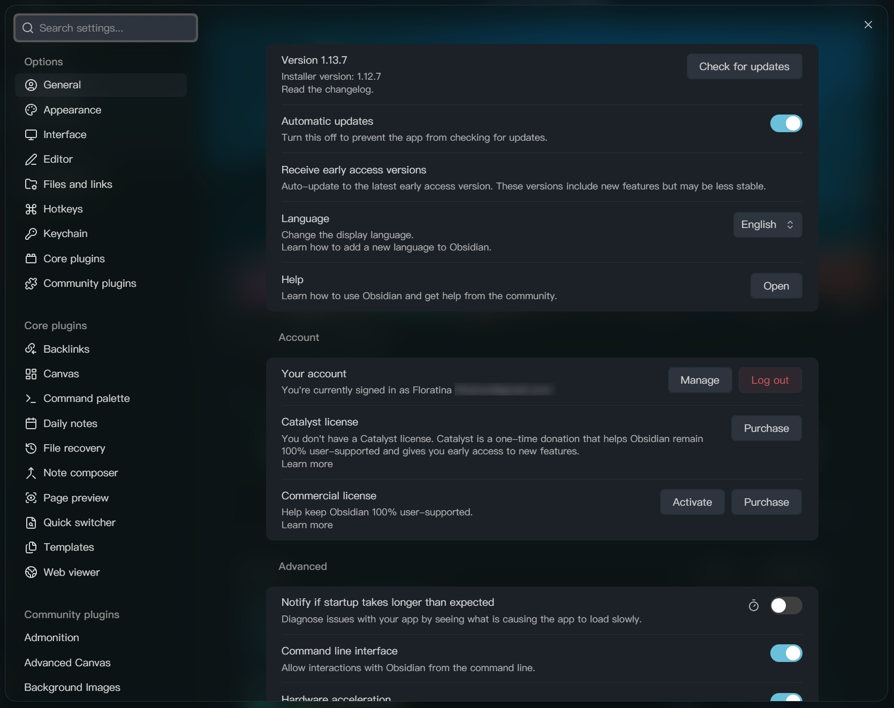
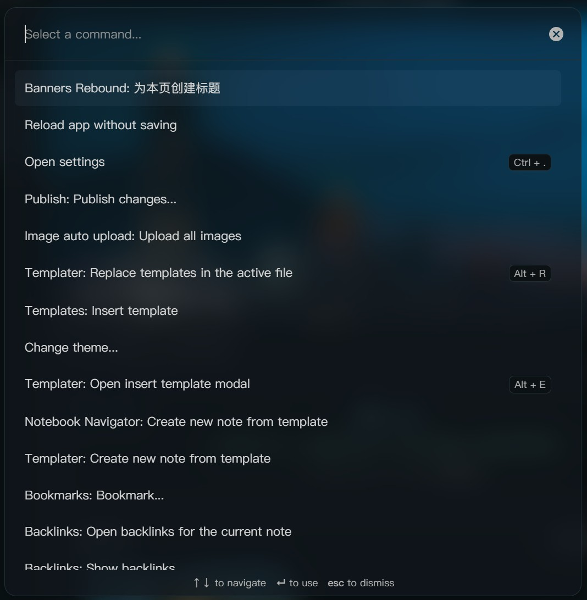
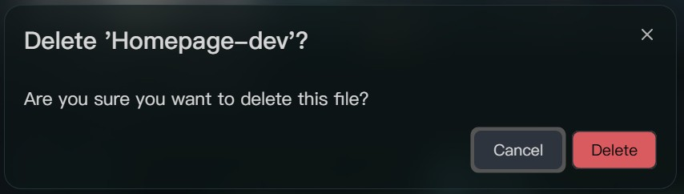
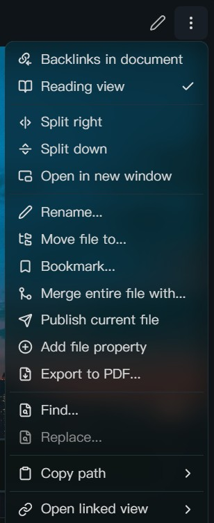

# Refined Modal

Natural opening and closing animations for Obsidian modals and context menus, with adjustable background blur and frosted glass.

English · [简体中文](README_zh.md)

Refined Modal is a visual enhancement plugin for **Obsidian desktop**. Let modals gently scale and fade into view, have context menus slide in from their opening direction, or blur the workspace behind a modal to bring its content into focus. Adjust animation duration, scale, and easing to suit your preferences.

## Preview

These screenshots show the frosted glass and translucent backgrounds. To try the opening and closing animations, select **Open preview** in the plugin settings. The appearance will vary with your theme, background content, and settings.

### Settings window

The settings modal in the main window can use frosted glass, allowing colors behind it to show through.

### Command palette

The command palette also supports a translucent, blurred background.

### Dialogs

Confirmation dialogs and other standard modals can share the same visual treatment.

### Context menus

Menus can retain their theme's background color while adding blur, balancing translucency with readable text.

## Features

### Modal animations

Add fade and scale transitions to standard modals, the command palette, the quick switcher, and similar interfaces. Opening and closing animations have separate controls:

- **Duration**: How long the animation lasts.
- **Size**: The starting size when opening and the final size when closing. For example, an opening size of 96% makes the modal grow from 96% of its original size to 100%.
- **Easing (how animation speed changes over time)**: Whether the animation moves at a constant speed, starts quickly and slows down, or follows another pattern.

### Context menu animations

Add opening and closing transitions to context menus and their submenus. Set separate durations for the opening fade, slide, and scale effects, and adjust the slide distance, opening size, closing duration, and closing size.

When a top-level menu opens upward or downward, the plugin adjusts the slide direction and the point from which it scales. Context menu animations can be toggled independently.

### Background effects

Adjust the blur, dimming, contrast, saturation, and scale of the workspace behind an open modal. The background returns to normal when the modal closes. Set separate durations and easing curves for these two transitions.

For more focus on the modal, try increasing the background blur or dimming. For a subtle sense of depth, try slightly reducing the background scale.

### Frosted glass

Add translucent backgrounds to modals, the command palette, context menus, and editor suggestions in the main window. Adjust blur, brightness, contrast, and saturation independently, and choose whether to keep the theme's original background color.

With **Keep original background color** enabled, **Background color opacity** controls how solid that color appears. Higher values make it more opaque; lower values reveal more of the content behind it. With the option disabled, only blur and filters remain.

**Background blur and frosted glass blur are separate settings**: the former changes the workspace behind a modal, while the latter changes the background seen through a modal or menu.

## Settings and preview

Open **Settings → Refined Modal** to customize the effects. Settings are organized into four tabs, apply immediately, and save automatically.

| Tab | Available controls |
| --- | --- |
| Background | Blur, dimming, contrast, saturation, scale, and the duration and easing of background transitions and restoration. |
| Modals | Opening and closing durations, starting and final sizes, and their easing curves. |
| Context menus | Animation toggle; fade, slide, and scale durations; slide distance; sizes; closing settings; and easing curves. |
| Frosted glass | Effect toggle, original background color and its opacity, blur, brightness, contrast, and saturation. |

Select **Open preview** near the top of the settings page to see the modal's opening animation. Press `Esc`, click outside the modal, or select **Close** to see its closing animation. After changing a setting, reopen the preview to compare the result.

Choose an easing preset, or select **Custom** and enter a `cubic-bezier(...)` expression (a cubic Bézier curve that defines how animation speed changes). If you are unfamiliar with easing curves, the defaults are a good starting point.

Each setting has a button to restore its default value. At the bottom of the page, **Reset all parameters** restores all visual and animation settings after confirmation, while keeping your language selection.

The interface supports Simplified Chinese, Traditional Chinese, English, and Japanese. It follows Obsidian's language by default, or you can choose a language in the plugin settings.

## Tips and compatibility

- **Start with the defaults**: Adjust one group of effects at a time and compare using the preview. To make scaling less noticeable, move the opening and closing sizes closer to 100%.
- **Readability**: If content behind the frosted glass makes text difficult to read, enable **Keep original background color** and increase the background color opacity.
- **Performance**: Large areas of blur and frosted glass can increase rendering load. If animations stutter, try disabling frosted glass or reducing the background blur radius.
- **Themes and other plugins**: Themes, CSS snippets (custom styles), and other plugins may also change modal and menu styles. If something looks wrong, temporarily disable related styles or plugins to check for conflicts.
- **Separate windows**: Frosted glass applies only to the main window, not to separate popout windows. If the settings page is in a separate window, the preview modal may still open in the main window.
- **Reduced motion**: The plugin respects the system's reduced motion preference by disabling modal and menu opening and closing animations, and removing workspace background scaling, filters, and transitions.

## License

This project is licensed under the [MIT License](https://github.com/Floratina/Obsidian-Refined-Modal/blob/main/LICENSE).
